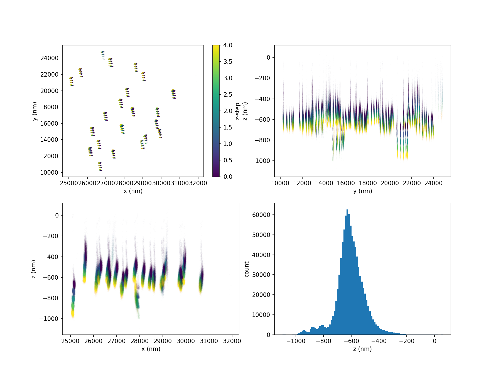
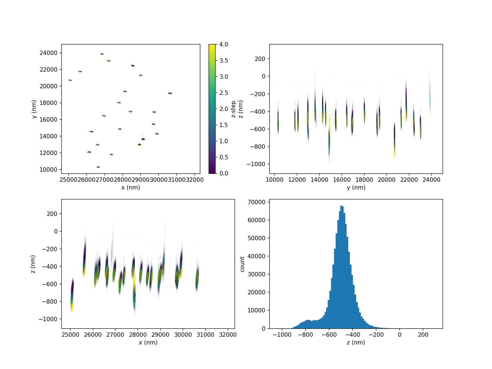
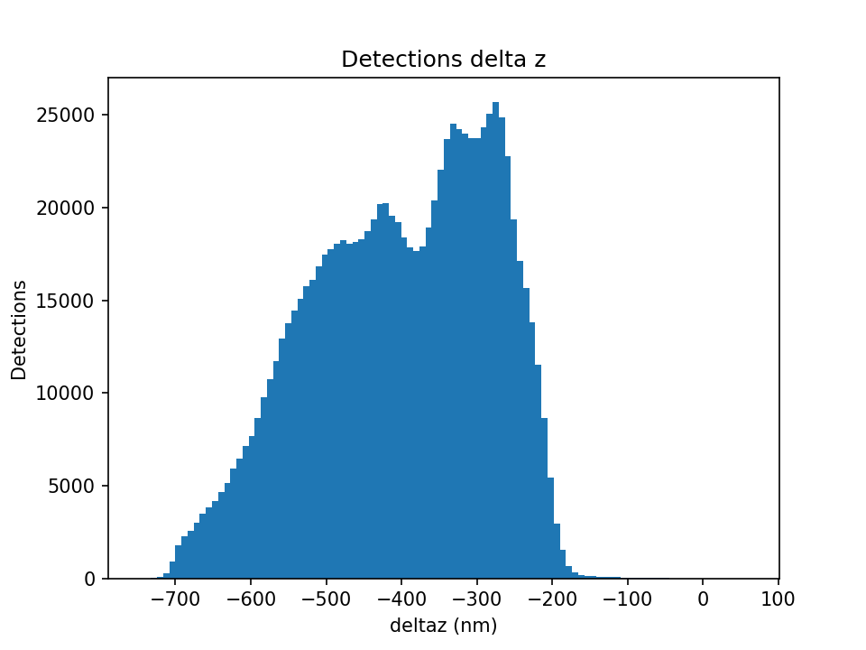
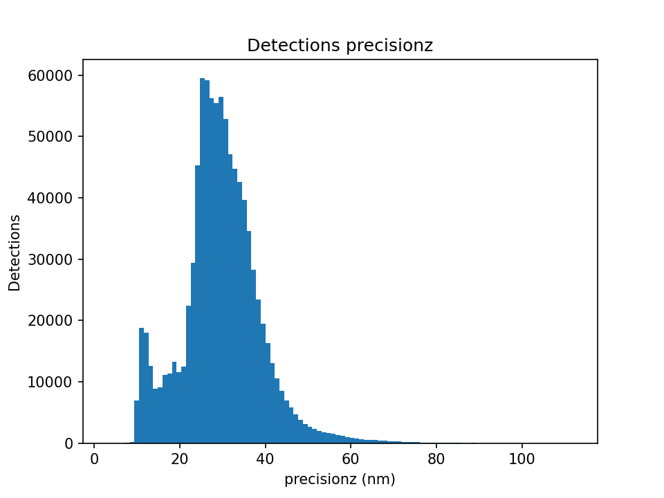
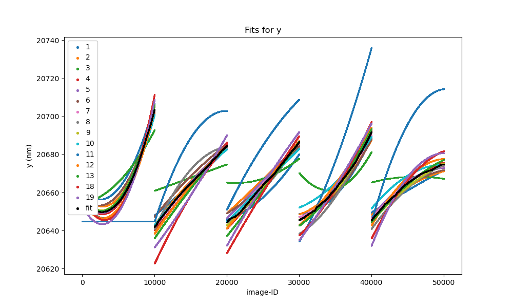
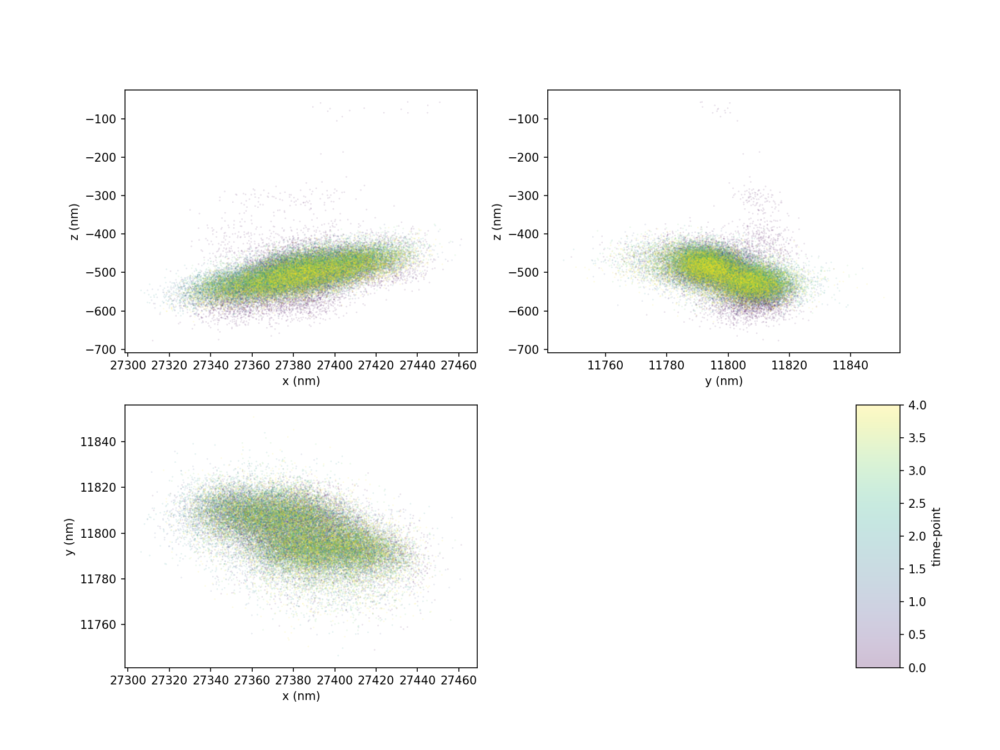
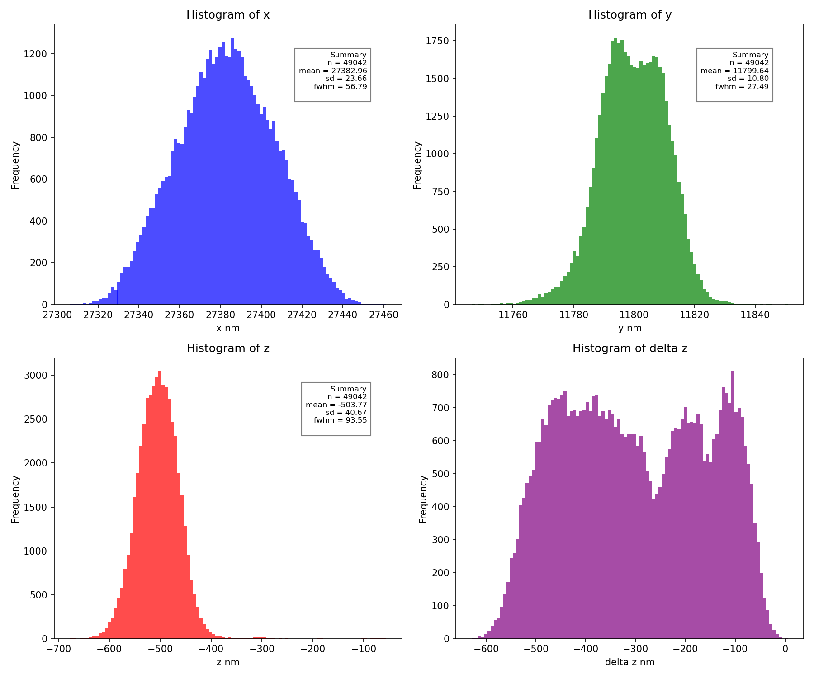
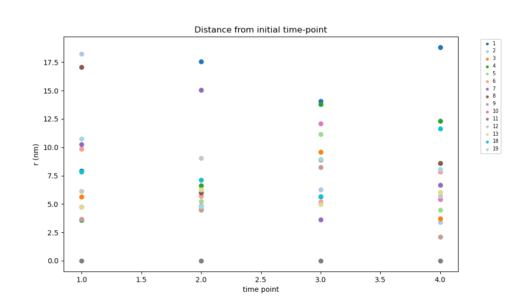

# QC and artefact correction for SMLM data using zedtool

## Workflow
### Steps


The zedtool processing pipeline (see the diagram above) follows these main steps:

1. Pre-process
   - Merge experiments and apply any pre-made drift corrections.
   - Filter detections and locate candidate fiducial markers.
   - Filter fiducials by quality metrics.

2. Plots \(Pre-correction\)
   - Visualize detections and segmented fiducials 
   - Plot detections and fiducial quality metrics to assess data before corrections.
   - Plot drift and movement diagnostics.

3. Corrections
   - Rotation correction of detections.
   - Drift correction using fitted fiducials.
   - \(\Delta\)z correction for axial offsets.

4. Plots \(Post-correction\)
   - Re-do pre-correction plots to assess the effect of corrections.

5. Outputs
   - Export corrected detection files, labeled detections and details of corrections. 

### Files


#### Inputs
- `config.yaml` — pipeline configuration (sets `output_dir`, fitting/filtering options, multiprocessing, column names).
See the [README](../../README.md) for more details.
- `detections_file.csv` — localisations assumed to be in a csv file.
- `concatenate_detections_file.csv` — optional extra localisations used when joining multiple experiments.
- `concatenate_offset_file.csv` — numeric offsets applied when concatenating experiments. 
Columns are those that need to be offset (e.g., `x`, `y`, `z`,`time-point`, `image-ID`) and the row contains 
the value that has to be added to the second experiment to make it consistent with the first.

#### Outputs
- `output_dir` — top-level output directory (set in `config.yaml`). Contains binned detection files,
drift correction details, logfile and backup of config file.
- `output_dir/summary_plots` — overview plots and QC figures.
- `output_dir/time_point_metrics` — per-time-point quality metrics and tables.
- `output_dir/fiducial_step_fit` — intermediate fit results for fiducial fitting steps generating drift corrections.
- `output_dir/fiducials` — per-fiducial diagnostics and data files.
- `output_dir/fiducials/histograms` — histograms and distribution plots for fiducial metrics.
- `output_dir/fiducials/f_idnum_z_value_y_value_x_value` — per-fiducial files (naming encodes fiducial id and mean coordinates).
- `output_dir_corrected` — mirror of `output_dir` containing corrected detection tables and plots.  Subfolders under `output_dir_corrected` 
replicate the same structure: `summary_plots`, `time_point_metrics`, `fiducials`, `fiducials/histograms`, 
and per-fiducial files named as above.

#### Localisation file format

A localisation file is a CSV file where each row represents a single localisation. The column names are specified in the config file, 
with default names listed below. Additional columns are allowed and will be preserved. 
If a column is marked as `zero` in the config file then it need not be present in the localisation file and will be created and initialised to `0`.

##### Default Column Names
The default column names follow the Vutara format, written here in yaml-style as they would appear in the config file.

```yaml
frame_col: frame           # number of images since the start of the time-point
image_id_col: image-ID     # number of images since the start of the experiment
z_step_col: z-step         # z position of the imaging plane encoded as an integer
cycle_col: cycle           # number of sweeps of the objective since the start of the time-point
time_point_col: time-point # the number of sequential labeling rounds since the start of the experiment 
x_col: x
y_col: y
z_col: z
x_sd_col: precisionx
y_sd_col: precisiony
z_sd_col: precisionz
photons_col: photon-count
chisq_col: chisq
deltaz_col: deltaz         # distance between z and imaging plane - automatically created if missing
log_likelihood_col: log-likelihood
llr_col: llr
probe_col: vis-probe
```

###### Sample localisation file Vutara format

```csv
frame,image-ID,z-step,cycle,time-point,x,y,z,precisionx,precisiony,precisionz,photon-count,chisq,deltaz,log-likelihood,llr,vis-probe,area
1,img001,0,1,1,1234.56,2345.67,150.2,10.5,11.2,20.0,1500,1.02,0.0,-345.6,12.3,A,45.2
2,img001,0,1,1,1235.10,2346.00,149.8,10.8,11.0,19.5,1400,0.98,0.0,-344.8,11.7,A,48.1
```

##### Specifying column names

The following is a portion of a config file for processing a file made
using Thunderstorm:

```yaml
image_id_col: frame 
frame_col: frame
time_point_col: zeros
x_col: "x [nm]"
y_col: "y [nm]"
z_col: zeros
x_sd_col: "sigma [nm]"
y_sd_col: "sigma [nm]"
z_sd_col: zeros
chisq_col: zeros
photons_col: "intensity [photon]"
z_step_col: zeros
cycle_col: zeros
deltaz_col: deltaz # distance between z and imaging plane - automatically created if missing
log_likelihood_col: zeros
llr_col: zeros
probe_col: zeros
```

###### Sample localisations in Thunderstorm format

```csv
"id","frame","x [nm]","y [nm]","sigma [nm]","intensity [photon]","offset [photon]","bkgstd [photon]","uncertainty [nm]"
1.0,1.0,2127.3318498388653,16340.527461169107,107.22122353737244,264.91639465558524,14.438872207683776,3.8321667129345767,10.931820904967148
2.0,1.0,2806.4236907180607,14057.775120679511,141.50261917701098,1393.176002510907,17.689110385550034,5.767525524125411,5.753838400571674
3.0,1.0,2761.5194198808767,15576.599860844663,111.24096252413386,690.124940865871,19.538992838523296,5.8301625537768205,6.926179611769085
4.0,1.0,3741.604997974105,9707.33175717059,112.73968099245164,428.6732078212021,13.790800037666964,3.801471070224385,8.067621278661006
```


#### Example Plots
The following examples of plots generated by zedtool are taken from
`Example 1` in https://zenodo.org/records/18483027.
The filenames assume the following settings in the config file:
```yaml
output_dir: output_dir
plot_format: png
```
##### `output_dir/fiducials_plot.png`
Log-scaled binned image showing the locations and ID's of fiducial markers prior to correction.


##### `output_dir/detections_summary.png`
Summary of detections prior to correction coloured by z-step.



##### `output_dir_corrected/detections_summary.png`
Summary of detections after correction coloured by z-step.



##### `output_dir/summary_plots/delta_z_histogram.png`
Histogran of $\Delta z$ values for all detections prior to correction. $\Delta z$ is the distance between the z coordinate of the detection 
and the z position of the imaging plane.



##### `output_dir/summary_plots/z_sd_histogram.png`
Historgram of the axial precision of detections prior to correction.




##### `output_dir/combined_corrections_y_vs_frame.png`
Drift corrections in y plotted against frame number.
Each line is a different fiducial marker and the black line is the consensus correction.
The x-axis is the frame number (number of images since the start of the experiment). 
The final drift correction will be computed as the difference between the consensus value at t and the 
consensus value at the start of the experiment.



##### `output_corrected/fiducials/f_0001_z_m0745_y_20699_x_25075/f_0009_z_m0503_y_11799_x_27382_cov_time-point.png`
Typical plot of a fiducial after correction coloured by time-point. The title of the plot encodes the fiducial ID and mean coordinates.
These plots are created for the range of covariates specified in `covariate_plot_quantities` in the config file. 



##### `output_corrected/fiducials/f_0001_z_m0745_y_20699_x_25075/f_0009_z_m0503_y_11799_x_27382_hist.png`
Histogram of a typical fiducial's coordinates after correction.



##### `output_corrected/time_point_metrics/fiducial_cumulative_r_vs_timepoint`
Timepoint-separation plot of the cumulative distance between fiducial positions at different time points from their initial position.




## Examples
The following contains examples of how to use zedtool to process SMLM data:
https://zenodo.org/records/18483027

* Example 1: Experiment demonstrating manual fiducial marker selection. 
* Example 2: Experiment in two parts that require joining.
* Example 3: Data generated by Thunderstorm.

## Frequently Asked Questions
### How can I speed up zedtool?
Here are several ways to speed up zedtool processing:
- remove plotting and processing steps that you don't need. For example, if you don't need to, don't use
`plot_summary_plots`, `plot_detections` and `plot_fiducials`.
- zedtool can use multiple threads and this can be turned on with `multiprocessing=1` and setting `n_processes`. 
Setting `n_processes` to `0` will use all available CPU cores. Parallelisation is done per-dimension or per-fiducial,
so there is no benefit to setting `n_processes` to be more than the maximum of these two.
- setting `use_pyarrow=1` will use the pyarrow library for faster reading and writing of CSV files.
---

### How much memory does zedtool need?
Allow for 2-5 times the size of the input detections file. The logfile will contain information about 
memory use after the detections have been read. For example:
```log
2025-10-22 18:39:18,024 - INFO - Memory use after reading detections.
2025-10-22 18:39:18,024 - INFO - Actual RAM use: RSS = 306.58 GB
2025-10-22 18:39:18,024 - INFO - Total virtual address space: VMS = 621.99 GB
```
---

### How can I make zedtool use less memory?
If you are running out of memory when processing large datasets, you can try the following:
- Disable multiprocessing with `multiprocessing=0` or reduce the number of threads with `n_processes`.
- Reduce the size of the dataset by filtering out unnecessary columns and rows with something else before processing.
For example `awk` or `xsv` (https://github.com/BurntSushi/xsv) can both be used to strip out unnecessary columns 
and rows from the input detections file.
- Turn off `use_pyarrow` if it is enabled. Pyarrow is faster but it uses more memory.
---

### What's the minimum number of fiducial markers that zedtool will work with?
- For drift correction you need at least 3 *good* fiducial markers. *Good* means that they have detections 
for the duration of the experiment and that their movement is consistent with each other. 
- For automatic fiducial selection and deltaz correction you need at least 10-20 good 
fiducial markers that are well distributed across the field of view.
You need enough to enable outlier detection and to show consistent deltaz trends. 
- For rotation correction you need at least 3-5 good fiducial markers distributed across 
the field of view to accurately estimate rotation parameters.
---

### I don't have enough fiducials to do automatic filtering. Can I still use zedtool?
Yes, you can still use zedtool to do *manual* fiducial selection and correction.
First, make sure that all automatic filtering steps are turned off in the config file.
That is, make sure the following settings are all set to `0` 
(note, their defaults are all `0`):
```yaml
sd_outlier_cutoff: 0
quantile_outlier_cutoff: 0
filter_fiducials_with_clustering: 0
```
Run zedtool with `drift_correct_detections=1` and then find the outlier fiducials as follows:
* Look at the patterns of movement in the binned image `output_dir/fiducials_plot.png`. 
Often the *bad* fiducials will be obvious here.
* Look at the drift correction plots `output_dir/combined_corrections_[xyy]_vs_frame.png`
and find the fiducial corrections that don't cluster with the others.
* Look at the time point separation plots `output_corrected/time_point_metrics/fiducial_cumulative_r_vs_timepoint`
and find the fiducials that show large cumulative movement across time points.
* Look at the file `/output_corrected/fiducials/fiducials_unfiltered.tsv` and find the fiducials with poor quality metrics
  (eg. `n_detections, x_sd, y_sd, z_sd, photons_mean, x_madr, y_madr, z_madr, time_point_separation, consensus_error`)

It also may be necessary to look at the per-fiducial plots in `output_corrected/fiducials/f_id_z_value_y_value_x_value` to confirm.
Now, make new config file with a different output directory and with the *bad* fiducials removed.
```yaml
output_dir: output_v2
excluded_fiducials: 1,4,6 # example of excluding fiducials with ID 1, 4 and 6.
```

Alternatively you can specify fiducials markers to keep using `included_fiducials`. 
Then run zedtool again with the new config file with the putative "good" fiducial markers retained and check the results.
---

### Because of sample movement, each fiducial marker is being segmented into multiple objects. What can I do?
Increase the values of `dilation_disc_radius` in the config file so that the segmented objects
are expanded so they merge together and pick up all the detections for the one fiducial marker.
---
