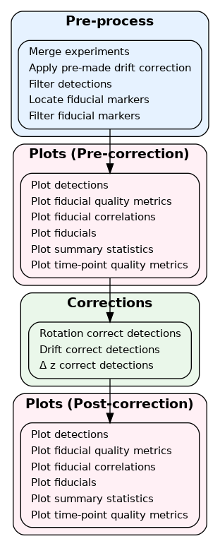
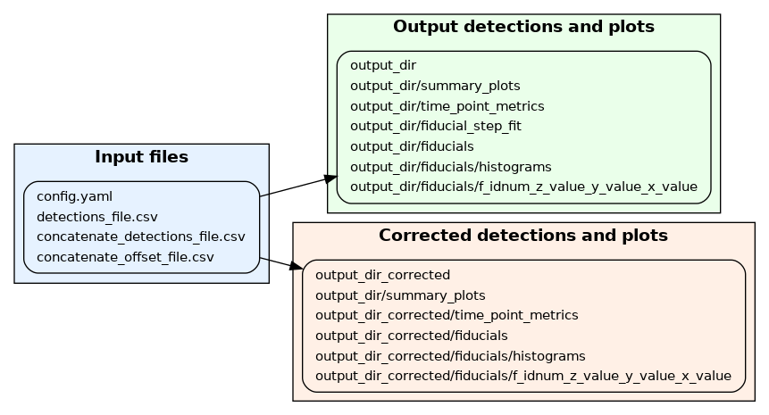
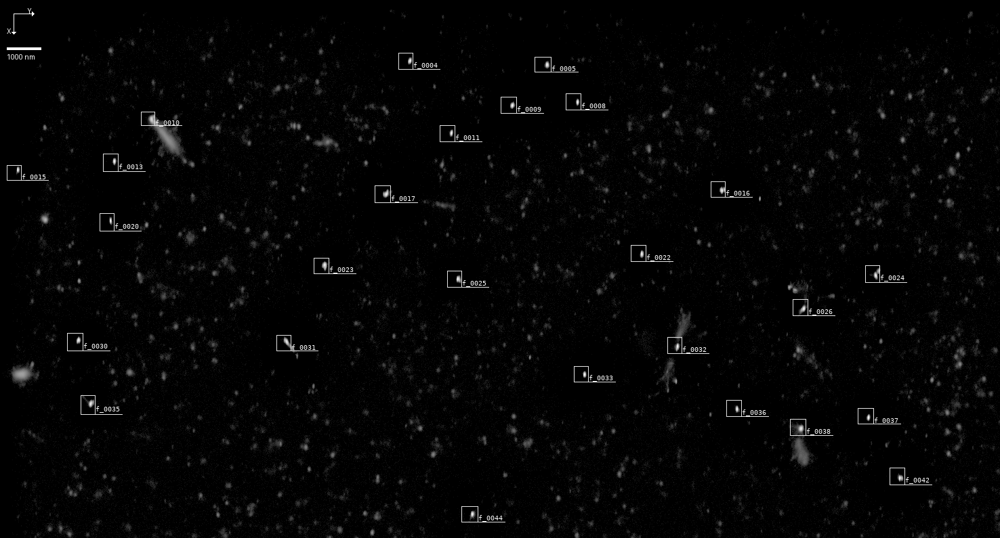

# Manual
Performing QC and artifact correction with zedtool

## Workflow overview
Text

### Steps

<!--  --> 


### Input and output files


### Detection file format

#### Specifying column names
* Adding and using the zeros column for use in missing columns.
 
## Quality assessment

### Plots 



### Tables

### Fiducials
Text

```bash
setting: value
```
## Quality filtering 
Text
```bash
setting: value
setting: value
```

## Position filtering 
Text
```bash
setting: value
setting: value
```

## Density filtering 
Text
```bash
setting: value
setting: value
```
## Fiducial markers

### Segmenting

### Assessing

### Filtering
* quantile or sd_outlier_cutoff
* filtering quantities: 'n_detections', 'n_images', 'detections_per_image', 'x_mean', 'x_sd', 'y_mean', 'y_sd', 'z_mean', 'z_sd', 'photons_mean', 'photons_sd', 'area', 'x_madr', 'y_madr', 'z_madr'
* detections_per_image also has cutoff from max_detections_per_image

### Selection

## Rotation correction

## Drift correction
* How the method works

### Fitting parameters

### Choosing fiducials

### Quality metrics

### Importing and exporting drift correction

## Deltaz correction

## Joining experiments
* Files required and offsets

## Further data exploration

### Telling between drift and localisation error

### Movement at small time scales


